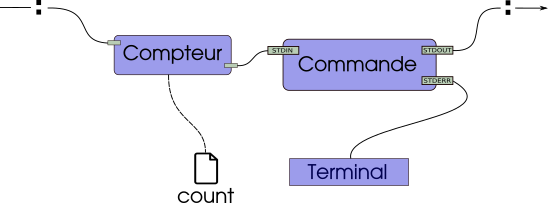

# TP2 - Compter les octets des redirections

L'objectif du TP2 est de développer l'utilitaire `tally` capable d'exécuter des conduites (*pipelines*) de commandes (comme le shell), mais aussi de comptabiliser le nombre d'octets qui transitent sur chacunes des redirections.
Ce TP vous permet d'approfondir la communication interprocessus avec les sockets UNIX (et l'appel système `socketpair`).

## Avant de commencer

* Cloner (le bouton `fork` en haut à droite) ce dépôt sur le gitlab départemental.
* Le rendre privé : dans `Settings` → `General` → `Visibility` → `Project visibility` → `Private` (n'oubliez pas d'enregistrer).
* Ajouter l'utilisateur `@abdenbi_m` comme mainteneur (oui, j'ai besoin de ce niveau de droits) : `Project information` → `Members` → `Invite member` → `@abdenbi_m`.
* ⚠️ Mal effectuer ces étapes vous expose à des pénalités importantes sans préavis.

## Description de l'outil `tally`

### Usage

```
tally CMD [ARG]... [: CMD [ARG]...]...
```

`tally` exécute en parallèle une séquence de commandes. Les commandes sont séparées par le caractère deux-points `:` qui joue le rôle de redirection. Les redirections faites par `:` sont implémentées par les *socket UNIX* avec une communication locale. 
Ainsi, tout comme `|` dans une conduite (*pipeline*) shell, `tally` avec `:` relient les commandes entre elles.

La sortie standard d'une commande est donc redirigée vers l'entrée standard de la commande suivante.
L'entrée standard de la première commande correspond à l'entrée standard de `tally` et la sortie standard de la dernière commande correspond à la sortie standard de `tally` (habituellement le terminal dans les deux cas).
La sortie standard pour les messages d'erreur n'est pas modifiée.

Le nombre d'octets qui transitent par chaque redirection `:` est comptabilisé et est écrit dans un fichier `count` qui se trouvera dans le répertoire où s'exécutera `tally`. 
Pour chaque redirection `:` le fichier `count` contiendra une ligne avec les informations suivantes,
- l'ordre de la redirection dans la conduite (le compte commence à `1`),
- suivi des caractères ` : ` (un espace, `:` et un espace),
- puis le nombre d'octets qui ont transités par la redirection,
- un saut de ligne `\n` pour terminer la ligne.

### Valeur de retour

En cas de succès, `tally` retourne le code de retour de la dernière commande. Si la dernière commande n'existe pas, le code de retour est `127`. Si la dernière commande se termine à cause d'un signal, le code de retour est `128` + **numéro du signal**.

Dans tous les cas, le programme `tally` ne se termine que lorsque **toutes les commandes se sont terminées**.
À part pour la dernière commande, les valeur de retour des autres commandes ne sont pas prise en compte.

En cas d'échec lors de mise en place de la conduite ou de tout problème interne, `tally` doit s'arrêter immédiatement, la valeur retournée doit être `1` et aucun message ne doit être affiché.

### Exemples d'exécution

<p>

<details>

<summary>Illustration</summary>



</details>

</p>

<p>

<details>

<summary>Exemple 1</summary>

<pre>
<b>groot@iam:~/$</b> ls
nevermind   tally
<b>groot@iam:~/$</b> ./tally wc nevermind 
 125  379 1922 nevermind
<b>groot@iam:~/$</b> echo $?
0
<b>groot@iam:~/$</b> ls
nevermind   tally
<b>groot@iam:~/$</b> ./tally cat nevermind : grep left : wc -c
42
<b>groot@iam:~/$</b> ls
count   nevermind   tally
<b>groot@iam:~/$</b> cat count
1 : 1922
2 : 42
</pre>

</details>

</p>

<p>

<details>

<summary>Exemple 2</summary>

<pre>
<b>groot@iam:~/$</b> ls
nevermind   tally
<b>groot@iam:~/$</b> ./tally cat nevermind : grep left : wc -c fail 2> /dev/null
<b>groot@iam:~/$</b> echo $?
1
<b>groot@iam:~/$</b> ls
count   nevermind   tally
<b>groot@iam:~/$</b> cat count
1 : 1922
2 : 42
</pre>

</details>

</p>

<details>

<summary>Exemple 3</summary>

<pre>
<b>groot@iam:~/$</b> ./tally cat tests/nevermind : grep the : sleep 1 : grep -v the tests/nevermind : wc -c
1679
<b>groot@iam:~/$</b> cat count
1 : 1922
2 : 243
4 : 1679
</pre>

</details>

</p>


## Directives d'implémentation

Le programme devra être réalisé en C en utilisant principalement les appels système UNIX vus en classe.
Le code source final (correctement commenté et nettoyé) devra tenir dans un seul fichier C.

Comme le TP n'est pas si gros (de l'ordre de grandeur d'une ou deux centaines de lignes), il est attendu un effort important sur le soin du code et la gestion des cas d'erreurs.

### Appels système

- **Vous devez utiliser l'appel système** `socketpair` pour créer votre mécanisme de communication inter-processus. 
- Vous devez utiliser les appels système `dup2` pour dupliquer les descripteurs et `close` pour fermer les descripteurs non utilisés.
- En plus des appels système cités plus haut, vous aurez besoin des appels système `fork`, `waitpid`, `wait`, `exit` et `execve` (les fonctions de librairie `execl`, `execlp`, `execle`, `execv`, `execvp` et `execvpe` **sont autorisées**).
- Noubliez pas de traiter les cas d'erreurs de vos appels système.

### Précisions

- Des octets **transitent** par une redirection si et seulement si ils sont **lus**. Autrement dit, ce qui sera affiché dans le fichier `count` c'est **le nombre strictement positif d'octets lus**. Si par exemple le nombre d'octets lus est nul, alors la ligne correspondante ne sera pas affichée dans le fichier `count`. 
  - Se référer à l'exemple 3 des *Exemples d'exécution*.
- Il est important de **fermer correctement les bouts de redirection** qui doivent l'être.
- Il est important que **les commandes s'exécutent en parallèle** et puissent lire ou produire des données aussi rapidement que possible. Un processus ne devrait pas se bloquer ou être ralenti à cause de `tally` sauf, naturellement, si elle doit attendre une donnée de la commande précédente (redirection vide) ou si elle doit attendre que la commande suivante consomme des données (redirection plein).
  - Ceci est également vrai même si `tally` compte les octets qui transitent entre les commandes, cette tâche devraient influer le moins possible sur l'exécution des commandes.

## Acceptation et remise du TP

### Remise

La remise s'effectue simplement en poussant votre code sur la branche `master` de votre dépôt gitlab privé.
Seule la dernière version disponible avant le **dimanche 12 décembre à 23h55** sera considérée pour la correction.

### Intégration continue

Vous pouvez compiler avec `make` (le `Makefile` est fourni).

Vous pouvez vous familiariser avec le contenu du dépôt, en étudiant chacun des fichiers (`README.md`, `Makefile`, `check.bats`, `.gitlab-ci.yml`, etc.).

⚠️ À priori, il n'y a pas de raison de modifier un autre fichier du dépôt.
Si vous en avez besoin, ou si vous trouvez des bogues ou problèmes dans les autres fichiers, merci de me contacter.

Le système d'intégration continue vérifie votre TP à chaque `push`.
Vous pouvez vérifier localement avec `make check` (l'utilitaire `bats` entre autres est nécessaire).

Les tests fournis ne couvrent que les cas d'utilisation de base, en particulier ceux présentés ici.
Il est **fortement suggéré** d'ajouter vos propres tests dans [local.bats](local.bats) et de les pousser pour que l’intégration continue les prenne en compte.
Ils sont dans un job distincts pour avoir une meilleure vue de l'état du projet.

❤ En cas de problème pour exécuter les tests sur votre machine, merci de 1. lire la documentation présente ici et 2. poser vos questions en classe ou sur [Mattermost](https://mattermost.info.uqam.ca/forum/channels/inf3173).
Attention toutefois à ne pas fuiter de l’information relative à votre solution (conception, morceaux de code, etc.)

### Barème et critères de correction

Le barème utilisé est le suivant

* Seuls les tests qui passent sur l'instance `gitlab.info.uqam.ca` (avec l'intégration continue) seront considérés.
  * 50%: pour le jeu de test public fourni dans le sujet (voir section intégration).
  * 50%: pour un jeu de test privé exécuté lors de la correction. Ces tests pourront être plus gros, difficiles et/ou impliquer des cas limites d'utilisation (afin de vérifier l'exactitude et la robustesse de votre code).
* Des pénalités pour des bogues spécifiques et des défauts dans le code source du programme, ce qui inclut, mais sans s'y limiter l'exactitude, la robustesse, la lisibilité, la simplicité, la conception, les commentaires, etc.
* Note: consultez la section suivante pour des exemples de pénalités et éventuellement des conseils pour les éviter.

## Mentions supplémentaires importantes

⚠️ **Intégrité académique**
Rendre public votre dépôt personnel ou votre code ici ou ailleurs ; ou faire des MR contenant votre code vers ce dépôt principal (ou vers tout autre dépôt accessible) sera considéré comme du **plagiat**.

⚠️ Attention, vérifier **=/=** valider.
Ce n'est pas parce que les tests passent chez vous ou ailleurs ou que vous avez une pastille verte sur gitlab que votre TP est valide et vaut 100%.
Par contre, si des tests échouent quelque part, c'est généralement un bon indicateur de problèmes dans votre code.

⚠️ Si votre programme **ne compile pas** ou **ne passe aucun test public**, une note de **0 sera automatiquement attribuée**, et cela indépendamment de la qualité de code source ou de la quantité de travail mise estimée.
Il est ultimement de votre responsabilité de tester et valider votre programme.

Pour les tests, autant publics que privés, les résultats qui font foi sont ceux exécutés sur l'instance `gitlab.info.uqam.ca`. Si un test réussi presque ou de temps en temps, il est considéré comme échoué (sauf rares exceptions).


Quelques exemples de bogues fréquents dans les copies TP de INF3173 qui causent une perte de points, en plus d'être responsable de tests échoués:

* Utilisation de variables ou de mémoire non initialisés (comportement indéterminé).
* Mauvaise vérification des cas d'erreur des fonctions et appels système (souvent comportement indéterminé si le programme continue comme si de rien n'était)
* Utilisation de valeurs numériques arbitraires (*magic number*) qui cause des comportements erronés si ces valeurs sont dépassées (souvent dans les tailles de tableau).
* Code inutilement compliqué, donc fragile dans des cas plus ou moins limites.


Quelques exemples de pénalités additionnelles:

* Vous faites une MR sur le dépôt public avec votre code privé : à partir de -10%
* Vous demandez à être membre du dépôt public : -5%
* Si vous critiquez à tort l'infrastructure de test : -10%
* Vous modifiez un fichier autre que le fichier source ou `local.bats` (ou en créez un) sans avoir l’autorisation : à partir de -10%
* Votre dépôt n'est pas un fork de celui-ci : -100%
* Votre dépôt n'est pas privé : -100%
* L'utilisateur `@abdenbi_m` n'est pas mainteneur : -100%
* Votre dépôt n'est pas hébergé sur le gitlab départemental : -100%
* Vous faites une remise par courriel : -100%
* Vous utilisez « mais chez-moi ça marche » (ou une variante) comme argument : -100%
* Si je trouve des morceaux de votre code sur le net (même si vous en êtes l'auteur) : -100%
